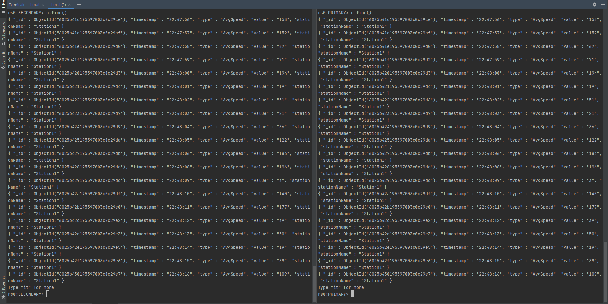

# VS "Connected Cars" 
This Project shows an example of "Connected Cars"  
We simulate a car that has an indefinite number of sensors ( 8 in the initial example) that communicate to a central system through an MoM (Message-oriented middleware): MQTT in particular. This data is then relayed to an HTTP Client that allows viewing the state of each sensor.  
The Data is first saved in the Central system and later persisted in cloud server cluster through Service Providers

Any number of sensors can be implemented by adding their corresponding container images to the [docker-compose.yml](docker-compose.yml) file. 
### MQTT  
We use Mosquitto as our MQTT Broker. Mosquitto is both lightweight and offering the management features we need.         
- The Central Station takes the role of a Subscriber  
- Each Sensor is a Publisher 
 
### HTTP Client 
  Sensor history is saved to a file (sensors) in the home folder of the CentralStation container, and each current sensor state value in saved in  JSON format in /sensor folder. These values are updated with each publish request done to the Mosquitto broker.    
  A server socket in the port 8080 is able handle HTTP GET requests. GET requests can be done to the files mentioned above to allow viewing them in a web browser. 

### RPC & Service Provider
 A service allowing the retrieval of the sensor data from the CentralStation is generated through an Apache Thrift file [InterfaceDef.thrift](Thrift/InterfaceDef.thrift).  
To ensure the consistency of the data. Data is retrieved each time a Message is received to the Subscriber(CentralStation).   
MongoDB is used as our Database Management System (DBMS). It being a document-oriented database program that can handle JSON formats, makes the management of our sensor data easier.

### High availability and consistency
To ensure redundancy and fail-safety, a cluster of MongoDB Server nodes is created using the Primary-Secondary Architecture. A custom Script [mongo_setup.sh](mongo_setup.sh) is run first on its own docker container "mongosetup". The shell script provides the server nodes with their respective hosts and their priority value in the server-structure.   
When the cluster configuration is done, the condition "service_healthy" is fullfilled and upon that the rest of the containers are launched.  

We use [Nginx](https://www.nginx.com/) as our loadbalancer and reverseproxy. All requests from the CentralStation(s) go through the Nginx access point and then relayed to one of the available Serviceproviders. The setup follows this config file [nginx.conf](nginx.conf).   
Upon failure(or manual shutdown) of one of the serviceproviders used, Nginx loadbalancer will automatically shift the requests to another online serviceprovider.  

  
## Dockerfiles
The files [sensorfile](sensorfile), [centralfile](centralfile), [serviceproviderfile](serviceproviderfile) and [proxyfile](proxyfile) are the docker files. In these files, the Java projects are compiled in the first step and in the second step the jar is copied into a new container which is used for the execution.  
We follow the [Multi-Stage Builds](https://docs.docker.com/develop/develop-images/multistage-build/) Practice   

## Installation
There are currently 8 sensors of types: Fuel Level, Kilometers travelled, Traffic state and Avg. speed. 4 of each for two CentralStations.  
The Sensor type, IP and custom id are each configured in the compose file [docker-compose](docker-compose.yml).   
There are also 3 Service providers connected to a MongoDB Server Cluster.  
All of the above can be freely expanded through the [docker-compose](docker-compose.yml) file.  

It's important to make sure if you're running Windows, to make sure that Windows didnt switch the formating of [mongo_setup.sh](mongo_setup.sh) from LF to CRLF. Otherwise an error occurs in the cluster configuration step.

A CentralStation will sometimes not load up correctly and not be connected to the RPC, Restarting it will solve the issue.

### How To - local build and run
- `docker-compose build`  
- `docker-compose up`  

### How To access Sensors in Web Client of CentralStation 1
- `localhost:8080/sensors` for sensor history  
- `localhost:8080/sensor/[1-4]` for each Sensors' current status  

### How To access Sensors in Web Client of CentralStation 2
- `localhost:8084/sensors` for sensor history  
- `localhost:8084/sensor/[1-4]` for each Sensors' current status  

### How To access the Remote MongoDB Database  
- `localhost:8081` to access the main MongoDB GUI
- `localhost:8081/db/vsdb/` to access the sensors database
  
## Gitlab CI
The Gitlab CI pipeline is in the file [.gitlab-ci.yml](.gitlab-ci.yml)  

## Tests

**Test 1:**
Check if Sensor Values are recieved correctly  
Execution:  
Compare output in Sensor container with output in Central container  
Result: **✓** Checked manually.
  
**Test 2:**
The roundabout time of each HTTP Request/Response is measured.  
Execution:  
Mesure how long the Central takes to answer Get requests   
Result:   
- Single Sensor HTTP GET Request : 4ms
- Complete Sensor history HTTP GET Request : 8ms

**Test 3:** 
Check if Sensor Values are persisted correctly in Service Provider Servers  
Execution:  
Compare saved sensor Values with the Service Provider's  
Result: **✓** Checked manually.

**Test 4:**  
Availability Test  
Execution:  
Continually send pings to the Service Provider Server and count the number of responses     
Result:  
```
--- serviceprovider ping statistics ---
1000 packets transmitted, 1000 received, 0% packet loss, time 1999ms
rtt min/avg/max/mdev = 0.031/0.072/0.222/0.018 ms
```
This result is to be taken with a grain of salt. That is since all containers are available locally (and not remote, which would have increased the unreliabiliy of the network).

**Test 5:**  
Check if Sensor Values are still recieved correctly with MQTT  
Execution:  
Compare output in Sensor container with output in Central container  
Result: **✓** Checked manually.

**Test 6:**  
Performance Test  
Execution:  
The number of sensors is scaled up to measure how many sensors the MQTT broker can handle  
Result: using the following command :
```
docker-compose up --scale sensor-1=10 (or any other number of sensors, depending on the system capabilities)
```
MQTT possible connections is only limited by the RAM(Random access memory) available.
Scaling sensors seems to be marginally memory intensive.


**Test 7:**  
Check if the sensor Values were correctly copied  
Execution:  
Compare Primary server data with Back-up data  
```
$ docker exec -it <DB container> mongo
$ rs.slaveOk() //to allow read operations to run on secondary nodes
$ use vsdb
$ c=db.<name of collection>
$ c.find()
```
Result: **✓** Checked manually.

  

**Test 8:** 
Usual System functionality in case of Server-failure (Servers are in Primary-Secondary Architecture Hot-Standby)  
Execution:  
Simulate server failure on Primary Server and see if data is still persisted  
Result: **✓** Checked manually.
The failure of one of the used serviceproviders, results in a temporary error. The system quickly recovers and nginx loadbalancer starts forwarding the payloads to another online serviceprovider. Data sent during the short transition is lost.
